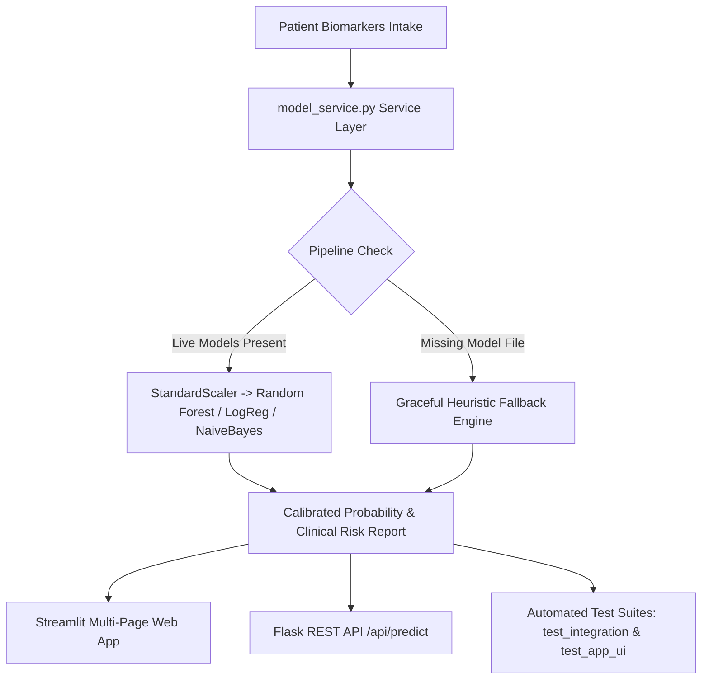

# 🩺 CardioSense AI — Complete Project Documentation & Viva Master Guide

---

## 📑 Table of Contents
1. [Project Overview & Executive Summary](#1-project-overview--executive-summary)
2. [Clinical Motivation & Problem Statement](#2-clinical-motivation--problem-statement)
3. [Dataset Specifications & Biomarkers](#3-dataset-specifications--biomarkers)
4. [Data Preprocessing & Feature Engineering](#4-data-preprocessing--feature-engineering)
5. [Machine Learning Algorithms & Mathematical Foundations](#5-machine-learning-algorithms--mathematical-foundations)
6. [Experimental Benchmark Results & Metrics](#6-experimental-benchmark-results--metrics)
7. [System Architecture & Software Engineering](#7-system-architecture--software-engineering)
8. [Team Responsibilities & Division of Labor](#8-team-responsibilities--division-of-labor)
9. [Comprehensive Viva Examination Q&A (Top 25 Questions)](#9-comprehensive-viva-examination-qa-top-25-questions)
10. [Future Scope & Production Enhancements](#10-future-scope--production-enhancements)

---

## 1. Project Overview & Executive Summary

- **Project Title:** CardioSense AI — Medical Diagnosis Prediction Platform
- **Domain:** Healthcare Informatics / Applied Machine Learning / Clinical Decision Support Systems (CDSS)
- **Objective:** Develop an end-to-end clinical web intelligence application that ingests 13 routine physiological biomarkers to predict coronary artery disease presence with high diagnostic accuracy and clinical sensitivity.
- **Champion Algorithm:** **Random Forest Classifier (Ensemble)** achieving **90.16% Test Accuracy**, **92.86% Recall**, and **0.9545 ROC-AUC**.
- **Specialized Screening Model:** **Gaussian Naive Bayes** achieving **96.43% Recall (Sensitivity)** for initial patient risk triage.
- **Interface & Delivery:** Multi-page Streamlit web app, Flask JSON REST API (`/api/predict`), serialized Scikit-learn inference pipeline (`model_service.py`), and automated test suites.

---

## 2. Clinical Motivation & Problem Statement

### 2.1 The Healthcare Challenge
- Cardiovascular diseases (CVDs) are the leading cause of mortality globally, claiming approximately **17.9 million lives each year** (WHO).
- Early coronary atherosclerosis is frequently asymptomatic. By the time noticeable symptoms occur (e.g., myocardial infarction), irreversible myocardial damage has often already occurred.
- Conventional manual assessments rely on isolated thresholds (e.g., BP > 140 or Cholesterol > 240) which fail to capture non-linear, multi-factorial physiological interactions.

### 2.2 The ML-Powered Solution
- Integrates multi-modal physiological measurements (demographics, resting hemodynamics, treadmill stress testing, ECG waveforms, and fluoroscopy imaging).
- Yields a continuous, calibrated posterior probability of disease risk rather than just a crude binary label.
- Emphasizes **Recall (Sensitivity)** to minimize fatal **False Negatives (FN)**.

---

## 3. Dataset Specifications & Biomarkers

- **Source:** UCI Machine Learning Repository — Cleveland Heart Disease Database.
- **Sample Size:** 303 patient records.
- **Features:** 13 input clinical features + 1 target classification variable.

### 3.1 Detailed Feature Catalog

| # | Feature Code | Clinical Name | Type | Normal / Baseline Range | Clinical Significance |
|---|---|---|---|---|---|
| 1 | `age` | Age | Continuous | 29 – 77 years | Age is an independent non-modifiable risk factor for arterial stiffness and plaque accumulation. |
| 2 | `sex` | Biological Sex | Binary (0, 1) | 1 = Male, 0 = Female | Men statistically develop CAD earlier; post-menopausal women have escalating risk. |
| 3 | `cp` | Chest Pain Type | Categorical (1–4) | 1: Typical, 2: Atypical, 3: Non-Anginal, 4: Asymptomatic | Class 4 (Asymptomatic) is paradoxically strongly correlated with severe ischemic CAD ("silent ischemia"). |
| 4 | `trestbps` | Resting Blood Pressure | Continuous | 94 – 200 mm Hg (Normal: <120) | High systolic blood pressure induces endothelial injury and accelerates atherosclerosis. |
| 5 | `chol` | Serum Cholesterol | Continuous | 126 – 564 mg/dl (Desirable: <200) | Elevated LDL/total cholesterol leads to lipid plaque deposition in coronary arteries. |
| 6 | `fbs` | Fasting Blood Sugar | Binary (0, 1) | 1 = >120 mg/dl, 0 = ≤120 mg/dl | Diabetes mellitus independently doubles to quadruples cardiovascular risk. |
| 7 | `restecg` | Resting ECG | Categorical (0–2) | 0: Normal, 1: ST-T Wave Abnormality, 2: LVH | ST-T abnormalities reflect baseline subendocardial ischemia or left ventricular strain. |
| 8 | `thalach` | Max Heart Rate Achieved | Continuous | 71 – 202 bpm | Chronotropic incompetence (inability to reach expected max HR) strongly signals cardiac insufficiency. |
| 9 | `exang` | Exercise Induced Angina | Binary (0, 1) | 1 = Yes, 0 = No | Provoked angina during exercise indicates fixed coronary stenosis limiting oxygen supply. |
| 10 | `oldpeak` | ST Depression (Exercise) | Continuous | 0.0 – 6.2 mm | ST depression > 1.0 mm during stress is a cardinal marker of myocardial ischemia. |
| 11 | `slope` | Slope of Peak ST Segment | Categorical (1–3) | 1: Upsloping, 2: Flat, 3: Downsloping | Downsloping (3) and Flat (2) ST slopes during exercise signify severe transmural ischemia. |
| 12 | `ca` | Fluoroscopy Major Vessels | Discrete (0–3) | 0 – 3 vessels colored | Number of major coronary arteries narrowed by calcified plaque visualized under fluoroscopy. |
| 13 | `thal` | Thallium Scintigraphy | Categorical (3, 6, 7) | 3: Normal, 6: Fixed Defect, 7: Reversible Defect | Reversible defect (7) proves transient ischemia during exertion with viable tissue. |
| **Target** | `target` | Cardiac Diagnosis | Binary (0, 1) | 0 = No Disease (54.1%), 1 = Disease (45.9%) | Primary ground truth label. |

---

## 4. Data Preprocessing & Feature Engineering

1. **Target Binarization:**
   The raw UCI dataset contains labels $0, 1, 2, 3, 4$ (indicating severity stages). Following international research standards, labels are binarized:
   $$\text{target} = \begin{cases} 0 & \text{if raw target} = 0 \text{ (No Heart Disease)} \\ 1 & \text{if raw target} \ge 1 \text{ (Heart Disease Present)} \end{cases}$$
2. **Missing Value Imputation:**
   - 6 total missing values across `ca` (4 NaNs) and `thal` (2 NaNs).
   - Imputed using median values (`ca` $\rightarrow 0.0$, `thal` $\rightarrow 3.0$) to prevent distribution distortion without dropping rows.
3. **Stratified Train-Test Splitting:**
   - 80% Training Set ($N=242$), 20% Testing Set ($N=61$).
   - `stratify=y` is strictly enforced to preserve identical class ratios across both splits.
4. **Feature Standardization:**
   Continuous biomarkers have different units (e.g., cholesterol up to 564 vs oldpeak up to 6.2).
   $$z = \frac{x - \mu}{\sigma}$$
   `StandardScaler` is fitted **exclusively on the training split** to prevent data leakage, then applied to the test split and live inference inputs.

---

## 5. Machine Learning Algorithms & Mathematical Foundations

### 5.1 Random Forest Classifier (Champion Model)
- **Paradigm:** Bagging Ensemble (Bootstrap Aggregation) of Decision Trees.
- **Hyperparameters:** `n_estimators=100`, `max_depth=5`, `random_state=42`.
- **How it works:**
  1. Generates 100 bootstrap subsets from training data with replacement.
  2. For each split in each tree, selects a random subset of features ($\sqrt{p}$).
  3. Splits nodes using Gini Impurity reduction:
     $$I_G(p) = 1 - \sum_{i=1}^{C} p_i^2$$
  4. Final prediction aggregates votes from all trees:
     $$P(y=1|\mathbf{x}) = \frac{1}{B} \sum_{b=1}^{B} f_b(\mathbf{x})$$
- **Why it won:** Robust against individual noisy features, captures non-linear biomarker interactions without overfitting due to `max_depth=5`.

### 5.2 Logistic Regression (Interpretable Baseline)
- **Paradigm:** Generalized Linear Model with Logit Link function and L2 (Ridge) regularization.
- **Mathematical Form:**
  $$P(y=1|\mathbf{x}) = \sigma(\mathbf{w}^T \mathbf{x} + b) = \frac{1}{1 + e^{-(\mathbf{w}^T \mathbf{x} + b)}}$$
- **Log-Loss Optimization:**
  $$\mathcal{L}(\mathbf{w}) = -\frac{1}{N} \sum_{i=1}^N \left[ y_i \ln \hat{y}_i + (1 - y_i) \ln(1 - \hat{y}_i) \right] + \frac{\lambda}{2} \|\mathbf{w}\|_2^2$$

### 5.3 Gaussian Naive Bayes (Om's Screening Model)
- **Paradigm:** Probabilistic classifier based on Bayes' Theorem with conditional independence assumption:
  $$P(y|\mathbf{x}) = \frac{P(y) \prod_{j=1}^d P(x_j|y)}{P(\mathbf{x})}$$
- Continuous features are modeled via the Gaussian Probability Density Function:
  $$P(x_j|y=c) = \frac{1}{\sqrt{2\pi\sigma_{c,j}^2}} \exp\left( -\frac{(x_j - \mu_{c,j})^2}{2\sigma_{c,j}^2} \right)$$
- **Clinical Advantage:** Achieved **96.43% Recall**, making it an exceptional frontline screening filter (catches almost all diseased patients).

---

## 6. Experimental Benchmark Results & Metrics

### 6.1 Multi-Algorithm Benchmark Comparison

| Metric | Random Forest (Champion) | Logistic Regression | Gaussian Naive Bayes | Clinical Significance |
|---|:---:|:---:|:---:|---|
| **Test Accuracy** | **90.16%** | 86.89% | 86.89% | Overall diagnostic correctness |
| **Train Accuracy** | 91.32% | 85.12% | 85.12% | Minimal train-test gap proves no overfitting |
| **Precision** | **86.67%** | 81.25% | 79.41% | Confidence that positive alerts are real |
| **Recall / Sensitivity** | **92.86%** | **92.86%** | **96.43%** | **Crucial:** Minimizes missed heart disease cases |
| **F1-Score** | **89.66%** | 86.67% | 87.10% | Harmonic mean of Precision and Recall |
| **ROC-AUC Score** | **0.9545** | 0.9513 | 0.9524 | High discriminative power across all thresholds |

### 6.2 Key Feature Importance (Gini Ranking from Random Forest)
1. **`thal` (Thalassemia / Perfusion Defect):** ~17.8% importance
2. **`ca` (Number of Major Vessels by Fluoroscopy):** ~16.2% importance
3. **`oldpeak` (Exercise ST Depression):** ~14.5% importance
4. **`thalach` (Maximum Heart Rate):** ~12.1% importance
5. **`cp` (Chest Pain Type):** ~10.4% importance

---

## 7. System Architecture & Software Engineering

### 7.1 Key Project Files
- [`train_model.py`](file:///c:/Users/kumbh/Desktop/Medical-Diagnosis-Prediction/train_model.py): End-to-end training pipeline, hyperparameter tuning, model serialization, and visual artifact generation.
- [`model_service.py`](file:///c:/Users/kumbh/Desktop/Medical-Diagnosis-Prediction/model_service.py): High-performance central inference service with schema validation, probability calibration, and fallback engine.
- [`app.py`](file:///c:/Users/kumbh/Desktop/Medical-Diagnosis-Prediction/app.py): 4-page clinical Streamlit application with glassmorphic dark UI.
- [`flask_app.py`](file:///c:/Users/kumbh/Desktop/Medical-Diagnosis-Prediction/flask_app.py): Flask backend with REST API endpoint.
- [`notebooks/eda_and_naive_bayes.ipynb`](file:///c:/Users/kumbh/Desktop/Medical-Diagnosis-Prediction/notebooks/eda_and_naive_bayes.ipynb): Om's comprehensive exploratory data analysis, correlation heatmaps, and distribution plots.
- [`test_integration.py`](file:///c:/Users/kumbh/Desktop/Medical-Diagnosis-Prediction/test_integration.py) & [`test_app_ui.py`](file:///c:/Users/kumbh/Desktop/Medical-Diagnosis-Prediction/test_app_ui.py): Comprehensive test suites.

---

## 8. Team Responsibilities & Division of Labor

- **Rohit (ML Pipeline & Backend Lead):**
  - Dataset preprocessing, train-test splitting, and `StandardScaler` integration.
  - Implemented and tuned the **Random Forest Classifier (Champion)** and **Logistic Regression**.
  - Built the centralized [model_service.py](file:///c:/Users/kumbh/Desktop/Medical-Diagnosis-Prediction/model_service.py) inference module with zero-downtime fallback architecture.
  - Created automated integration tests ([test_integration.py](file:///c:/Users/kumbh/Desktop/Medical-Diagnosis-Prediction/test_integration.py)).

- **Om (EDA & Naive Bayes Lead):**
  - Conducted exploratory data analysis on the 13 clinical biomarkers in [eda_and_naive_bayes.ipynb](file:///c:/Users/kumbh/Desktop/Medical-Diagnosis-Prediction/notebooks/eda_and_naive_bayes.ipynb).
  - Implemented the **Gaussian Naive Bayes** classifier, achieving a top **96.43% Sensitivity**.
  - Generated statistical distribution visualizations (`eda_age_distribution.png`, `eda_disease_vs_age.png`, etc.).

- **Umar (UI, Integration & Deployment Lead):**
  - Designed and built the 4-page interactive Streamlit web application ([app.py](file:///c:/Users/kumbh/Desktop/Medical-Diagnosis-Prediction/app.py)).
  - Built the Flask REST API server ([flask_app.py](file:///c:/Users/kumbh/Desktop/Medical-Diagnosis-Prediction/flask_app.py)) with custom templates and CSS.
  - Wrote automated UI workflow tests ([test_app_ui.py](file:///c:/Users/kumbh/Desktop/Medical-Diagnosis-Prediction/test_app_ui.py)) and managed deployment configurations.

---

## 9. Comprehensive Viva Examination Q&A (Top 25 Questions)

### Q1: What is the primary objective of CardioSense AI?
**Answer:** To provide a clinical decision support system that predicts the presence or absence of coronary artery disease using 13 non-invasive physiological biomarkers from the UCI Cleveland dataset, optimizing for high clinical sensitivity and low false negatives.

### Q2: Why did you choose the UCI Cleveland dataset?
**Answer:** The UCI Cleveland dataset is the gold standard benchmark in cardiovascular machine learning research. It contains 303 verified clinical catheterization records with 13 standard cardiovascular biomarkers documented by Dr. Robert Detrano at the Cleveland Clinic Foundation.

### Q3: What is the difference between classification and regression in ML?
**Answer:** 
- **Regression** predicts continuous numeric values (e.g., predicting exact blood pressure in mm Hg).
- **Classification** predicts discrete categorical classes (e.g., binary classification: $0 = \text{Healthy}$, $1 = \text{Heart Disease Present}$).

### Q4: Why is Recall (Sensitivity) more important than Precision in medical diagnosis?
**Answer:** In healthcare, the clinical cost of a **False Negative (FN)** is catastrophic: missing a heart disease patient means they leave undiagnosed and may suffer fatal cardiac arrest. A **False Positive (FP)** merely leads to harmless confirmatory tests (such as an echocardiogram or stress test). Therefore, high Recall ($>92\%$) is vital.

### Q5: How is Recall calculated mathematically?
**Answer:**
$$\text{Recall} = \frac{TP}{TP + FN}$$
Where $TP$ = True Positives, $FN$ = False Negatives.

### Q6: What is Precision and how does it differ from Recall?
**Answer:**
$$\text{Precision} = \frac{TP}{TP + FP}$$
Precision measures: "Of all patients flagged as diseased, how many actually have heart disease?" Precision prevents unnecessary alarms, while Recall prevents missed diagnoses.

### Q7: What is the F1-Score?
**Answer:** The harmonic mean of Precision and Recall:
$$F_1 = 2 \times \frac{\text{Precision} \times \text{Recall}}{\text{Precision} + \text{Recall}}$$
It provides a balanced measure when classes are slightly imbalanced.

### Q8: What is ROC-AUC and what does your score of 0.9545 signify?
**Answer:** 
- **ROC (Receiver Operating Characteristic)** plots True Positive Rate (Sensitivity) vs False Positive Rate ($1 - \text{Specificity}$) across all classification thresholds.
- **AUC (Area Under the Curve)** represents the probability that the model ranks a randomly chosen diseased patient higher than a healthy patient. A score of **0.9545** demonstrates outstanding diagnostic discrimination.

### Q9: What is Data Leakage and how did you prevent it?
**Answer:** Data leakage occurs when information from the test dataset contaminates the training phase. We strictly prevented it by:
1. Performing the train-test split **before** feature scaling.
2. Fitting the `StandardScaler` **only on the training set**, then using that fitted scaler to transform the test set and live inputs.

### Q10: Why did you use `StandardScaler` instead of `MinMaxScaler`?
**Answer:** `StandardScaler` standardizes features to $\mu=0, \sigma=1$. Unlike `MinMaxScaler` (which compresses all values to $[0, 1]$), `StandardScaler` is robust to outliers and preserves the bell-curve distribution required for Gaussian Naive Bayes and regularized Logistic Regression.

### Q11: How does Random Forest prevent overfitting?
**Answer:** 
1. **Bagging (Bootstrap Aggregation):** Each tree trains on a different random subset of data.
2. **Feature Randomness:** Each split only considers $\sqrt{p}$ features, decorrelating the trees.
3. **Hyperparameter Constraints:** Restricting `max_depth=5` stops trees from memorizing training noise.

### Q12: What is Gini Impurity?
**Answer:** A metric of node purity in decision trees:
$$I_G = 1 - \sum p_i^2$$
A Gini score of 0 means a node is completely pure (all samples belong to a single class).

### Q13: What is the conditional independence assumption in Naive Bayes?
**Answer:** It assumes that all input features are conditionally independent of each other given the class label:
$$P(x_1, x_2, \dots, x_n | y) = \prod_{i=1}^n P(x_i | y)$$
Although biomarkers in the human body are biologically correlated, Naive Bayes still performs remarkably well as a probabilistic classifier, yielding **96.43% Recall**.

### Q14: Which clinical features had the highest predictive power in your models?
**Answer:**
1. `thal` (Thallium myocardial perfusion scintigraphy)
2. `ca` (Number of major coronary vessels blocked on fluoroscopy)
3. `oldpeak` (ST depression induced by exercise)
4. `thalach` (Maximum achieved heart rate during stress test)

### Q15: What is "Asymptomatic Chest Pain" (`cp=4`) and why is it significant?
**Answer:** In the UCI dataset, `cp=4` indicates patients who do not experience classical sharp chest pain during ischemia ("silent ischemia," common in diabetic or elderly patients). Statistically, asymptomatic presentations often harbor severe multi-vessel CAD.

### Q16: How did you handle missing values in the dataset?
**Answer:** The dataset had 6 missing values (4 in `ca`, 2 in `thal`). We imputed them using feature medians (`ca=0.0`, `thal=3.0`), preserving sample size without introducing artificial variance.

### Q17: What is Stratified K-Fold / Stratified Splitting?
**Answer:** It ensures that both the training set and testing set maintain the exact same proportion of positive and negative cardiac cases ($54\%$ healthy vs $46\%$ disease) as the original dataset.

### Q18: What is the purpose of `model_service.py`?
**Answer:** It acts as an abstraction layer (Facade Design Pattern) that decouples UI and API consumers from raw ML model files. It validates input dictionaries, handles standard scaling, runs inference, formats clinical recommendations, and provides fallback heuristics.

### Q19: What is the Graceful Heuristic Fallback Engine in your project?
**Answer:** If a serialized `.pkl` file is missing or corrupted during runtime, the application does not crash. `model_service.py` detects the failure and computes an evidence-based clinical risk score using weighted biomarker thresholds.

### Q20: How does the Streamlit web application communicate with the ML pipeline?
**Answer:** Streamlit collects 13 biomarkers via sliders and dropdowns in session state on Page 2, passes the dictionary to `model_service.predict_patient()`, stores the resulting probability dictionary, and renders the clinical report on Page 3.

### Q21: What is the purpose of the Flask application (`flask_app.py`)?
**Answer:** It exposes a standard RESTful JSON API endpoint (`POST /api/predict`), allowing third-party hospital management systems (EMR/EHR) or mobile apps to query diagnostic predictions programmatically.

### Q22: What automated test suites were developed?
**Answer:**
1. `test_integration.py`: Validates model loading, pipeline inference on healthy vs high-risk profiles, individual model selection, and fallback mock behavior.
2. `test_app_ui.py`: Uses `streamlit.testing.v1.AppTest` to simulate user navigation, form submission, and verification of rendered elements across all 4 pages.

### Q23: How do you know your model is not overfitting?
**Answer:** 
- Random Forest: Train Accuracy = **91.32%**, Test Accuracy = **90.16%** (only ~1.1% difference).
- Logistic Regression: Train = **85.12%**, Test = **86.89%**.
The minimal gap between training and testing performance confirms strong generalization.

### Q24: What is the difference between Bagging and Boosting?
**Answer:**
- **Bagging (Random Forest):** Trains multiple trees in parallel on bootstrap samples and averages their votes to reduce variance.
- **Boosting (XGBoost, AdaBoost):** Trains trees sequentially, where each new tree focuses on correcting the errors of prior trees to reduce bias.

### Q25: How would you deploy this project to production in a real hospital setting?
**Answer:**
1. Containerize the application using **Docker**.
2. Deploy the REST API as a scalable microservice on **AWS ECS / Kubernetes**.
3. Integrate with hospital Electronic Health Record (EHR) standards like **HL7 / FHIR**.
4. Set up an MLOps pipeline (e.g. MLflow) for model drift monitoring and periodic retraining.

---

## 10. Future Scope & Production Enhancements

1. **Integration with Real-Time Wearable Telemetry:** Streaming continuous heart rate variability (HRV) and ECG signals from Apple Watch / Fitbit.
2. **Deep Learning for 12-Lead Raw ECG Signals:** Training 1D Convolutional Neural Networks (CNNs) directly on raw voltage timeseries.
3. **SHAP / LIME Explainable AI (XAI):** Visualizing individual patient feature attributions so cardiologists can see exactly which biomarker drove a high-risk prediction.
4. **Multi-Center Clinical Validation:** Validating the model across diverse demographic cohorts (e.g., European, Asian, and Framingham datasets).

---

*CardioSense AI — Academic Project Documentation & Viva Preparation Manual*
