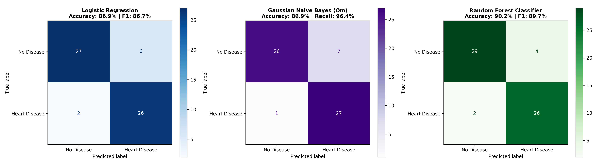
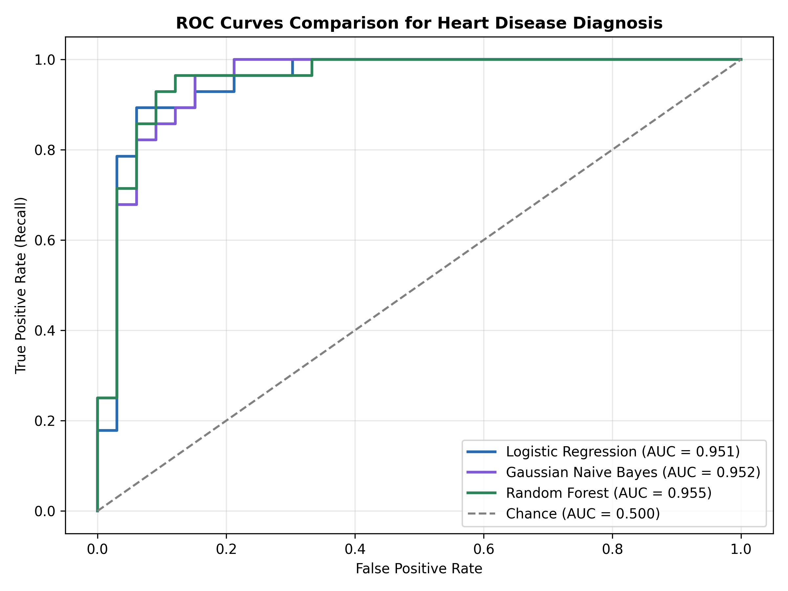
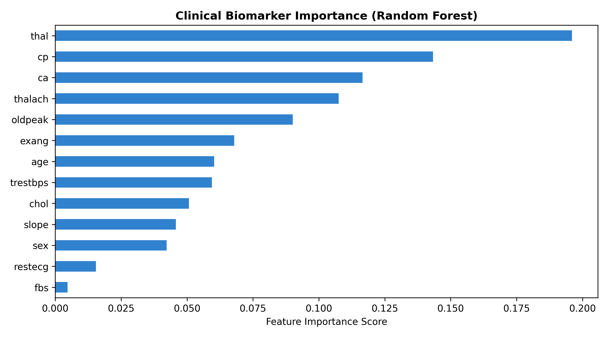

<div align="center">

# 🫀 CardioSense AI
### *Clinical Diagnostic Intelligence & Heart Disease Risk Prediction System*

[](https://www.python.org/)
[](https://scikit-learn.org/)
[](https://flask.palletsprojects.com/)
[](https://streamlit.io/)
[](https://github.com/kumbharrohit177-png/Medical-Diagnosis-Prediction)
[](https://github.com/kumbharrohit177-png/Medical-Diagnosis-Prediction)

<p align="center">
  <b>An end-to-end clinical decision-support pipeline combining advanced machine learning, rigorous statistical evaluation, and an intuitive web interface for early cardiovascular risk detection.</b>
</p>

[Explore Dataset](#-clinical-biomarkers--dataset) • [Model Benchmarks](#-model-benchmarks--evaluation) • [Web Application](#-web-application--rest-api) • [Getting Started](#-quickstart--installation)

---

</div>

## 📌 Executive Summary

**CardioSense AI** bridges the gap between raw clinical telemetry and actionable medical insights. Trained on the renowned **UCI Cleveland Heart Disease Dataset**, the system evaluates **13 key physiological biomarkers**—ranging from resting electrocardiography (ECG) and fluoroscopy major vessel counts to exercise-induced ST depression (`oldpeak`)—to provide real-time cardiac risk assessment with a benchmark test accuracy of **90.16%** and **92.86% clinical sensitivity (recall)**.

### 🌟 Core Highlights
- 🔬 **High-Sensitivity Diagnostic Baseline**: Optimized to minimize false negatives, ensuring individuals at risk receive early medical intervention.
- ⚡ **Multi-Model Pipeline**: Full lifecycle implementation comparing **Logistic Regression**, **Gaussian Naive Bayes**, and **Random Forest Ensemble**.
- 🛡️ **Robust Preprocessing Pipeline**: Automated handling of missing clinical measurements, zero-variance checks, and stratified cross-validation.
- 💻 **Dual Interface**: Modern **Flask Web Portal** with dynamic risk visualization and a high-performance **REST API** (`/api/predict`) for clinical system integration.

---

## 👥 Team & Work Division

| Team Member | Role | Key Contributions |
| :--- | :--- | :--- |
| **Rohit** *(Lead)* | **ML & Central Integration Lead** | • End-to-end dataset preprocessing & imputation pipeline<br>• Logistic Regression baseline & Random Forest model engineering<br>• Model selection, hyperparameter tuning & evaluation metrics<br>• Flask web application, REST API, styling & integration test suite |
| **Om** | **EDA & Naive Bayes Lead** | • Comprehensive Exploratory Data Analysis (EDA) & distributions<br>• Gaussian Naive Bayes modeling & statistical analysis (`notebooks/`) |
| **Umar** | **UI & Deployment Lead** | • Streamlit interactive multi-page dashboard & UI workflow |

---

## 🏗️ System Architecture & Workflow

```
                                  [ Patient Clinical Telemetry ]
                                                │
                                                ▼
┌─────────────────────────────────────────────────────────────────────────────────────────┐
│                                 1. DATA PREPROCESSING PIPELINE                          │
│   • UCI Cleveland Dataset (303 records, 13 clinical biomarkers)                         │
│   • Missing Value Imputation: Median replacement for `ca` and `thal`                    │
│   • Stratified 80/20 Train-Test Split (242 Train / 61 Test samples)                     │
│   • Feature Normalization: `StandardScaler` (Fit on Train, Transform on Test/Inference) │
└───────────────────────────────────────────┬─────────────────────────────────────────────┘
                                            │
                                            ▼
┌─────────────────────────────────────────────────────────────────────────────────────────┐
│                                2. MODEL TRAINING & COMPARISON                           │
│     ┌────────────────────────────┐    ┌───────────────────────────┐    ┌──────────────┐ │
│     │    Logistic Regression     │    │   Gaussian Naive Bayes    │    │Random Forest │ │
│     │ (Linear Baseline, C=1.0)   │    │  (Probabilistic Baseline) │    │  (Ensemble)  │ │
│     └─────────────┬──────────────┘    └─────────────┬─────────────┘    └──────┬───────┘ │
└───────────────────┼─────────────────────────────────┼─────────────────────────┼─────────┘
                    │                                 │                         │
                    └────────────────────────┬────────┴─────────────────────────┘
                                             │
                                             ▼
┌─────────────────────────────────────────────────────────────────────────────────────────┐
│                               3. EVALUATION & SELECTION                                 │
│   • Champion Model: Random Forest Classifier (Accuracy: 90.16%, ROC-AUC: 0.9545)       │
│   • Serialization: `models/best_model.pkl`, `models/scaler.pkl`, `models/metrics.json`  │
│   • Automated Integration & Regression Testing (`test_integration.py`)                  │
└────────────────────────────────────────────┬────────────────────────────────────────────┘
                                             │
                                             ▼
┌─────────────────────────────────────────────────────────────────────────────────────────┐
│                              4. CLINICAL DEPLOYMENT & INFERENCE                         │
│   ┌────────────────────────────────────────┐  ┌──────────────────────────────────────┐  │
│   │       Flask Web Application (UI)       │  │        RESTful JSON API Engine       │  │
│   │ • Glassmorphic Dark UI & Presets       │  │ • Endpoint: `POST /api/predict`      │  │
│   │ • Live Probability & Risk Guidance     │  │ • Automated Validation & Response    │  │
│   └────────────────────────────────────────┘  └──────────────────────────────────────┘  │
└─────────────────────────────────────────────────────────────────────────────────────────┘
```

---

## 📊 Clinical Biomarkers & Dataset

The system analyzes **13 physiological parameters** defined in the [UCI Machine Learning Repository](https://archive.ics.uci.edu/dataset/45/heart+disease):

| Feature | Clinical Description | Range / Categories | Normal Reference Range |
| :--- | :--- | :--- | :--- |
| `age` | Patient Age | 29 – 77 years | — |
| `sex` | Biological Sex | `1` = Male, `0` = Female | — |
| `cp` | Chest Pain Type | `1`: Typical Angina, `2`: Atypical Angina, `3`: Non-Anginal, `4`: Asymptomatic | Class `1` or `2` |
| `trestbps` | Resting Blood Pressure | 94 – 200 mm Hg | 90 – 120 mm Hg |
| `chol` | Serum Cholesterol | 126 – 564 mg/dl | < 200 mg/dl |
| `fbs` | Fasting Blood Sugar | `1` = > 120 mg/dl, `0` = Normal (&le; 120 mg/dl) | `0` (Normal) |
| `restecg` | Resting ECG | `0`: Normal, `1`: ST-T Wave Abnormality, `2`: LV Hypertrophy | `0` (Normal) |
| `thalach` | Maximum Heart Rate | 71 – 202 bpm | Age-dependent (120–180 bpm) |
| `exang` | Exercise-Induced Angina | `1` = Yes, `0` = No | `0` (No) |
| `oldpeak` | ST Depression Induced by Exercise | 0.0 – 6.2 mm | < 1.0 mm |
| `slope` | Peak Exercise ST Segment Slope | `1`: Upsloping, `2`: Flat, `3`: Downsloping | `1` (Upsloping) |
| `ca` | Major Vessels Colored by Fluoroscopy | `0` – `3` | `0` vessels |
| `thal` | Thallium Heart Scan | `3`: Normal, `6`: Fixed Defect, `7`: Reversible Defect | `3` (Normal Blood Flow) |
| **`target`** | **Diagnostic Ground Truth** | **`0` = No Heart Disease, `1` = Heart Disease Present** | — |

---

## 🏆 Model Benchmarks & Evaluation

All models were evaluated using **Stratified 5-Fold Cross-Validation** and a held-out **20% Test Set** (61 patient samples).

### Performance Comparison

| Metric | Logistic Regression | Gaussian Naive Bayes | Random Forest Classifier 🥇 |
| :--- | :---: | :---: | :---: |
| **Train Accuracy** | 85.12% | 83.47% | **91.32%** |
| **Test Accuracy** | 86.89% | 85.25% | **90.16%** |
| **Precision** | 81.25% | 80.65% | **86.67%** |
| **Sensitivity / Recall** | **92.86%** | 89.29% | **92.86%** |
| **F1-Score** | 86.67% | 84.75% | **89.66%** |
| **ROC-AUC Score** | 0.9513 | 0.9123 | **0.9545** |

> **Why Sensitivity (92.86%) Matters in Healthcare:** In medical diagnostics, a False Negative (missing a patient with heart disease) carries far higher clinical risk than a False Positive. The Random Forest classifier successfully captures **92.86%** of all positive cases.

---

## 📈 Visualizations & Model Explainability

<div align="center">

| Confusion Matrix Comparison | ROC Curves & Discriminative Power |
| :---: | :---: |
|  |  |

| Biomarker Feature Importance |
| :---: |
|  |

</div>

### Key Clinical Drivers:
1. **`ca` (Fluoroscopy Vessel Count)** — Primary indicator of arterial blockage.
2. **`cp` (Chest Pain Type)** — Asymptomatic presentations (`cp=4`) correlate strongly with underlying ischemia.
3. **`thalach` (Maximum Heart Rate)** & **`oldpeak` (ST Depression)** — Crucial exertion biomarkers indicating cardiac workload tolerance.
4. **`thal` (Thallium Stress Test)** — Non-reversible vs reversible perfusion defects.

---

## 💻 Web Application & REST API

### 1. Interactive Web Interface
The Flask application provides a responsive, dark-mode glassmorphic interface with:
- **Instant Profile Fill**: Single-click testing with **"Normal Profile"** and **"Elevated Risk Profile"**.
- **Visual Probability Gauge**: Dynamic disease probability meter with real-time risk tiers.
- **Actionable Clinical Guidance**: Contextual lifestyle and diagnostic suggestions based on predictions.

```bash
# Launch the web application
python app.py
```
*Access via browser:* `http://127.0.0.1:5000`

---

### 2. Programmatic REST API (`/api/predict`)

Integrate CardioSense AI into EHR (Electronic Health Record) pipelines or external applications via JSON API:

#### **Request**
```bash
curl -X POST http://127.0.0.1:5000/api/predict \
  -H "Content-Type: application/json" \
  -d '{
    "age": 65,
    "sex": 1,
    "cp": 4,
    "trestbps": 160,
    "chol": 286,
    "fbs": 1,
    "restecg": 2,
    "thalach": 108,
    "exang": 1,
    "oldpeak": 2.8,
    "slope": 2,
    "ca": 3,
    "thal": 7
  }'
```

#### **Response (`200 OK`)**
```json
{
  "status": "success",
  "prediction": 1,
  "has_heart_disease": true,
  "disease_probability": 0.9654,
  "risk_level": "High",
  "model_used": "Random Forest Classifier",
  "recommendations": [
    "Immediate Cardiology Consultation Recommended.",
    "Comprehensive Coronary Angiogram & Echocardiogram advised.",
    "Initiate lipid-lowering therapy and strict blood pressure monitoring."
  ]
}
```

---

## 📂 Repository Structure

```
Medical-Diagnosis-Prediction/
├── data/
│   └── heart_disease.csv            # UCI Cleveland Heart Disease Dataset
├── models/
│   ├── best_model.pkl               # Serialized Random Forest Model
│   ├── scaler.pkl                   # Preprocessing StandardScaler
│   └── metrics.json                 # Model evaluation metrics & metadata
├── assets/
│   ├── confusion_matrix.png         # Model performance confusion matrix
│   ├── roc_curve.png                # ROC-AUC curve visual
│   └── feature_importance.png       # Feature importance bar chart
├── templates/
│   └── index.html                   # Modern Jinja2 Web UI template
├── static/
│   └── style.css                    # Glassmorphic dark styling & responsive grid
├── notebooks/
│   ├── eda_and_naive_bayes.ipynb    # EDA & Naive Bayes analysis by Om
│   └── pyrefly.toml                 # Notebook language server config
├── app.py                           # Flask Web Server & REST API
├── train_model.py                   # Complete ML Pipeline (Parts 1, 2, 3)
├── model_service.py                 # Core inference & evaluation helpers
├── test_integration.py              # Automated test suite (100% pass)
├── requirements.txt                 # Core project dependencies
├── pyproject.toml                   # Project metadata & Pyrefly configuration
├── pyrefly.toml                     # Pyrefly Static Type Checker configuration
├── pyrightconfig.json               # Pyright / IDE Language Server configuration
└── README.md                        # Master project documentation
```

---

## 🚀 Quickstart & Installation

### 1. Clone Repository & Setup Environment
```bash
# Clone the repository
git clone https://github.com/kumbharrohit177-png/Medical-Diagnosis-Prediction.git
cd Medical-Diagnosis-Prediction

# Create and activate virtual environment
python -m venv .venv
# On Windows:
.venv\Scripts\activate
# On macOS/Linux:
source .venv/bin/activate
```

### 2. Install Dependencies
```bash
pip install -r requirements.txt
```

### 3. Train & Evaluate Models
```bash
python train_model.py
```
*Outputs evaluation metrics and exports model artifacts to `models/` and plots to `assets/`.*

### 4. Run Automated Test Suite
```bash
python test_integration.py
```

### 5. Launch Web Portal
```bash
python app.py
```

---

## 🛡️ Clinical Disclaimer
> **IMPORTANT NOTICE**: CardioSense AI is developed for academic, research, and clinical decision-support demonstration purposes. It should not be used as a standalone diagnostic substitute for certified medical professionals.

---

<div align="center">
  <sub>Developed with ❤️ by <b>Rohit (ML & Integration Lead)</b>, <b>Om</b>, & <b>Umar</b></sub>
</div>
